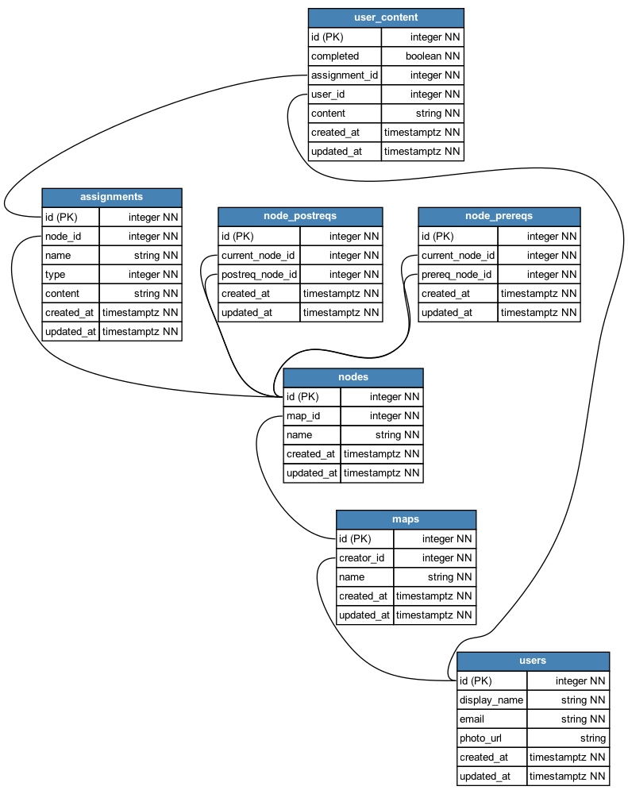

# Auto DB Diagram: an ERD generation tool

This tool was built to solve the pains of maintaining database diagrams on software projects such as regularly having to make new diagrams and dealing with descrepancies between your diagrams and your actual databases. Just download the tool, pass it your database info, and let it handle the diagrams!



## Installation

To install on Mac or Linux:

```bash
brew tap jamesdaniel3/auto-db-diagram
brew install db-diagram
```

## Headless Usage

The code can be run in headless mode, in which case, you must pass the file path to a config file:

```bash
db-diagram  --headless /Users/jamesdaniel/automatic-db-digrammer/config.json
db-diagram  -h /Users/jamesdaniel/automatic-db-digrammer/config.json
```

The structure of valid config files varies based on the type of database you want to connect to, but examples can be found under `/configs_examples/valid_configs`. In addition to examples, here is a slightly more formal explanation of the permitted fields in the config file, depending on the database you are trying to connect to.

```TypeScript
postgreSQLConfig {
  database_type: "postgres"
  connection_info: {
    host: string;
    port: number;
    username: string;
    database_name: string;
    password?: string;
  };
  excluded_tables?: string[];
}
```

```TypeScript
mySQLConfig {
  database_type: "mysql"
  connection_info: {
    host: string;
    port: number;
    username: string;
    database_name: string;
    password?: string;
  };
  excluded_tables?: string[];
}
```

```TypeScript
SQLiteConfig {
  database_type: "sqlite"
  connection_info: {
    database_location: string;
  };
  excluded_tables?: string[];
}
```

Note: a question mark denotes an optional field, any fields included but not listed will be ignored.

## Interactive Mode Usage

Alternatively, the program can be run in interactive mode, where it will walk you through the setup:

```
db-diagram
```

This tool currently supports connections to the following:

- postgreSQL instances
- SQLite instances
- MySQL instances

## Planned Features

- SQL Server Connections
- Hosted DB Connections

## Contributing

- [Spot a Bug?](https://github.com/jamesdaniel3/auto-db-diagram/issues)
- [Want to add something?](https://github.com/jamesdaniel3/auto-db-diagram/pulls)
